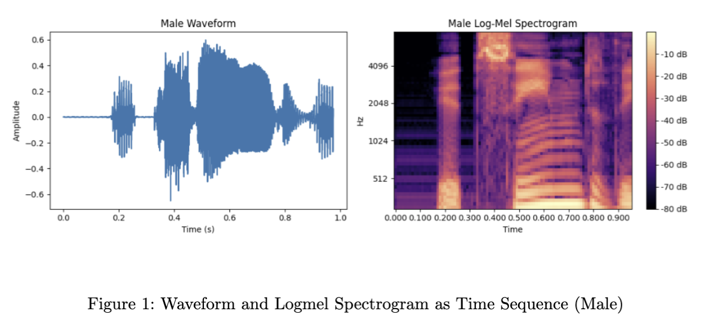
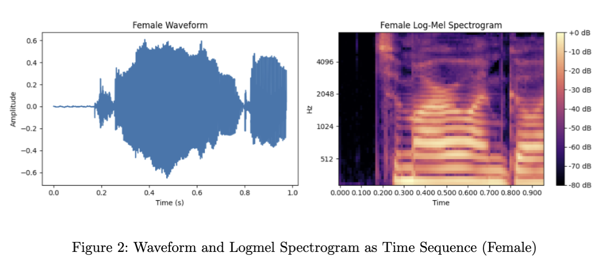

# Integrated-Project---LEAN-Model-for-Audio-Gender-Classification
# Gender Classification using LEAN Model

  

## 📖 Overview
While Natural Language Processing (NLP) and Computer Vision are dominant fields in AI, **Audio and Speech processing** have gained significant traction in recent years. Industry leaders like NVIDIA are actively expanding into speech data recognition [1], signaling a growing need to explore auditory fields.

There are generally five main auditory classes in signal classification: *noise, natural sound, artificial sound, speech, and music* [2]. This project focuses specifically on **Human Speech** to perform **Gender Classification**.

## 🎯 Objective
The primary goal of this project is to evaluate the **LEAN Model** on a binary classification task (Male vs. Female). 

In the original paper [3], the model was trained on **FSD50K**, a multi-label dataset, resulting in evaluation metrics below 0.5. The hypothesis of this project is that the LEAN model is better suited for binary classification, and training it on a specific binary dataset should yield significantly higher performance.

## 📊 Dataset Exploration
The project utilizes an imbalanced dataset consisting of two distinct classes.

| Class | Audio Files | Description |
| :--- | :--- | :--- |
| **Male** | ~10,400 | Dominant class |
| **Female**| ~5,768 | Minority class |

> **Note:** The dataset is imbalanced (approx. 2:1 ratio), which requires careful handling during training to avoid bias.

## 🧠 Model Architecture: LEAN
The LEAN model is designed to process audio data using two distinct input types:
1.  **Raw Waveform**
2.  **Log-Mel Spectrogram**

### Data Visualization
We have processed the data into time sequences for both input types. Below are visual representations of the processed signals:

#### Male Subject

*Figure 1: Waveform and Logmel Spectrogram as Time Sequence (Male)*

#### Female Subject

*Figure 2: Waveform and Logmel Spectrogram as Time Sequence (Female)*

## 🧪 Experiments & Hypothesis
* **Original Approach:** The original LEAN paper used FSD50K. As a multi-label dataset, it presented a complex challenge that resulted in low metrics (below 0.5).
* **Current Approach:** By simplifying the problem to a **Binary Classification** task (Male/Female), this project aims to demonstrate the true potential and feature extraction capabilities of the LEAN architecture.

## 📚 References
1.  NVIDIA Speech Data Recognition Recruitment.
2.  Audio Signal Classification Features.
3.  *LEAN: Learning efficient audio networks*

---

### 🔧 How to Run (Placeholder)
```bash
# Clone the repository
git clone [https://github.com/yourusername/project-name.git](https://github.com/yourusername/project-name.git)

# Install dependencies
pip install -r requirements.txt

# Run training
python train.py --dataset_path /path/to/data
